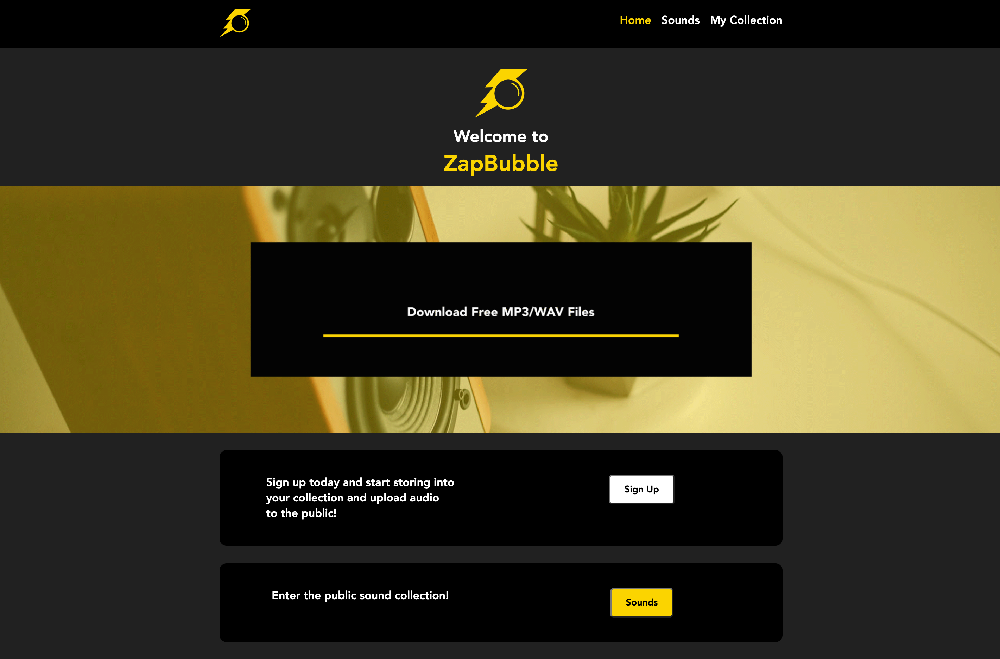

# Zapbubble Audio Download & Upload

This project consists of a Nodejs server and a Vuejs frontend. The main purpose of this
web app is to have the option to download free wav/mp3 files from a public collection and allow
registered users too be able to upload thier own sounds into the public collection.



## Resource

**Audio**

Attributes:

* name (string)
* fileName (string)
* audioUrl (string)
* user (string)
* date (string)

**User**

Attributes:

* userName (string)
* firstName (string)
* lastName (string)
* encryptedPassword (string

## Schema

```mongodb
Audio ({
name: STRING,
fileName: STRING,
audioUrl: STRING,
user: mongoose.Schema.Types.ObjectID});
User ({
userName: String,
firstName: String,
lastName: String,
encryptedPassword: String})
})
```

## REST Endpoints

Name                           | Method | Path
-------------------------------|--------|------------------
Retrieve audio collection      | GET    | /posts
Retrieve audio member          | GET    | /posts/*\<id\>*
Create audio member            | POST   | /posts
Delete audio member            | DELETE | /posts/*\<id\>*
Create User                    | POST   | /users
Login User                     | POST   | /session
Logout User                    | DELETE | /session

## Heroku Link

https://fast-temple-56003.herokuapp.com/index.html
